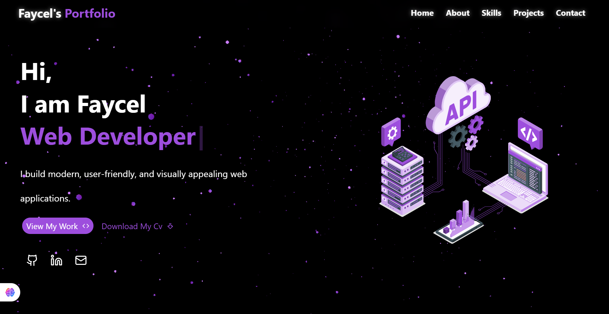

# 🖥️ My Portfolio  

Welcome to my personal portfolio! 🚀  
This project is built with **React**, **Tailwind CSS**, and **Framer Motion** to showcase my skills, projects, and journey as a developer.  

---

## ✨ Features  
- ⚡ **Responsive Design** – works seamlessly on desktop, tablet, and mobile  
- 🎨 **Smooth Animations** powered by Framer Motion  
- 🌙 **Modern UI/UX** styled with Tailwind CSS  
- 📂 **Projects Section** highlighting my work  
- 📞 **Contact Section** with links to my socials  

---

## 🛠️ Tech Stack  
- **React** ⚛️ – component-based UI  
- **Tailwind CSS** 🎨 – utility-first styling  
- **Framer Motion** 🎬 – animations and transitions  

---

## 🚀 Getting Started  

Clone the repo and install dependencies:  

```bash
git clone https://github.com/kebasfaycel/my-portfolio.git
cd my-portfolio
npm install
npm start
```
## 📸 Preview

